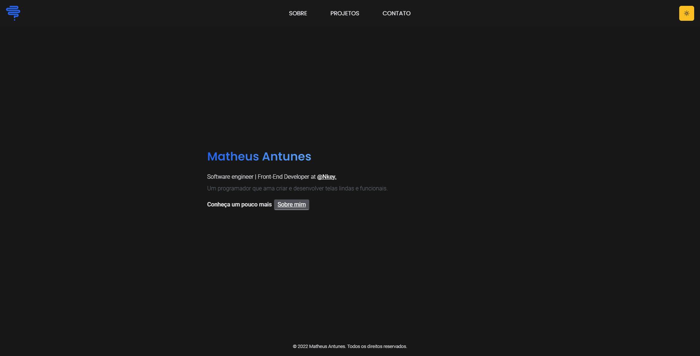

<h1 align="center">
  Hazael
</h1>

### 🌕 Dark Theme

### ☀️ Light Theme

  <a href="#-tecnologias">Tecnologias</a>&nbsp;&nbsp;&nbsp;|&nbsp;&nbsp;&nbsp;
  <a href="#-projeto">Projeto</a>&nbsp;&nbsp;&nbsp;|&nbsp;&nbsp;&nbsp;
  <a href="#-licença">Licença</a>

## 🚀 Tecnologias

Esse projeto foi desenvolvido com as seguintes tecnologias:

- ReactJS
- Tailwind CSS
- Framer Motion

## 🚧 Projeto

Live Preview: https://mathsbrain.dev/

<!-- ## 🎨 Inspiração:

Figma: https://www.figma.com/file/lz9lLpFHMxHm2odnwM3R0z/gpt3 -->

## Licença

Esse projeto está sob a licença MIT. Veja o arquivo [LICENSE](LICENSE) para mais detalhes.

---

Feito com ♥ by mathsbrain
